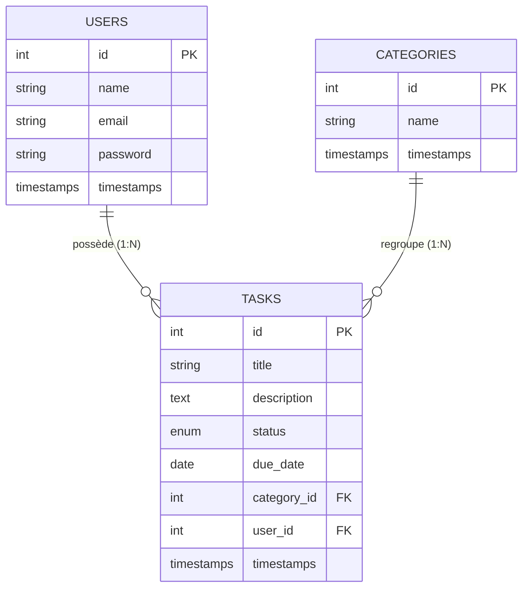
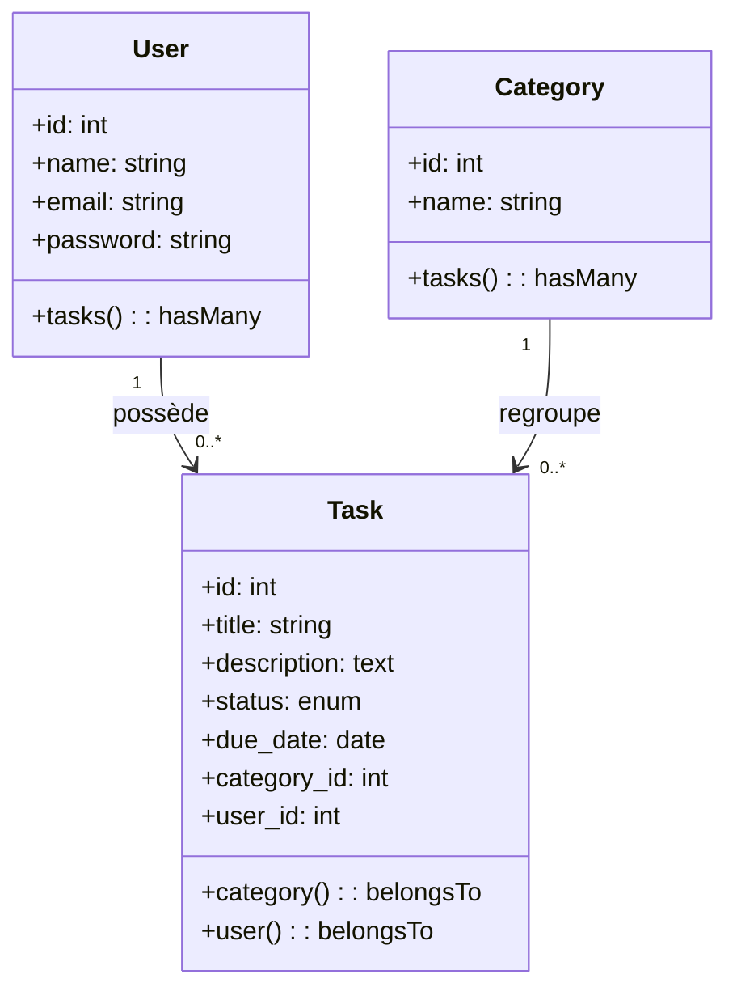
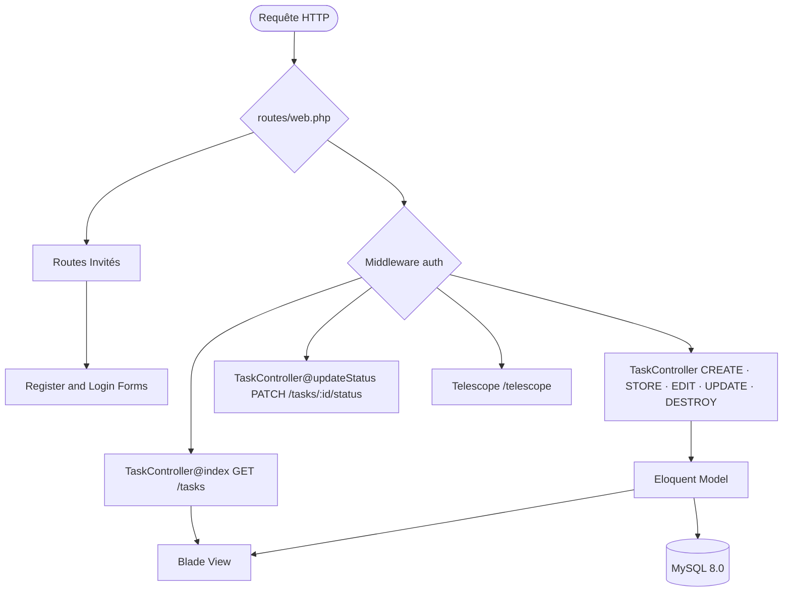

# 📝 Task-hub — Gestionnaire de Tâches Interne

Application web de gestion de tâches quotidienne pour employés, développée avec Laravel et déployée via Docker (Sail). Ce projet permet à chaque utilisateur de gérer son espace de travail de manière isolée et sécurisée, avec un suivi précis de l'état d'avancement des tâches.

---

## 🚀 Fonctionnalités Clés

- **Espace Personnel Isolé** : Chaque utilisateur ne voit et ne gère que ses propres tâches (Middleware & Policy).
- **Authentification complète** : Inscription, Connexion et Déconnexion sécurisées.
- **Gestion des Tâches (CRUD)** : Création, modification, suppression et lecture des tâches avec titres, descriptions et catégories.
- **Changement Rapide de Statut** : Mise à jour du statut (À faire → En cours → Terminé) directement depuis la liste.
- **Filtrage Intelligent** : Filtres par statut et par catégorie pour une meilleure organisation.
- **Outils de Debugging** : Intégration complète de Laravel Debugbar et Laravel Telescope pour le monitoring.

---

## 🏗️ Architecture & Conception

### 📊 Schéma Entité-Relation



### 📋 Tables de la Base de Données

1. **USERS** (**id**, name, email, password, timestamps) — (1:N avec TASKS)
2. **CATEGORIES** (**id**, name, timestamps) — (1:N avec TASKS)
3. **TASKS** (**id**, title, description, status `todo|in_progress|done`, due_date, category_id, user_id, timestamps) — (N:1 avec USERS et CATEGORIES)

### 🗺️ Diagramme de Classes



### 🔄 Routing Flow


---

## 📂 Structure du Projet

```bash
Task-hub/
├── compose.yaml                        # Services : laravel.test (app), mysql, phpmyadmin
├── taskboard.md                        # Suivi Scrum / Tickets Jira
├── app/Http/Controllers/
│   ├── TaskController.php              # CRUD complet + filtres + changement statut
│   └── Auth/                           # Login, Register, Logout
├── app/Models/
│   ├── Task.php                        # belongsTo Category & User + Scope filters
│   ├── Category.php                    # hasMany Tasks
│   └── User.php                        # hasMany Tasks
├── database/migrations/                # Tables users, categories, tasks
├── database/seeders/                   # Initialisation des catégories et tests
├── resources/views/
│   ├── layouts/app.blade.php           # Layout principal (@auth / @guest)
│   ├── tasks/                          # index (dashboard), create, edit
│   └── auth/                           # login, register
├── routes/web.php                      # Routes nommées et groupées par middleware
└── README.md
```

---

## 🛠️ Installation & Setup

1. **Clone le repo** :
   ```bash
   git clone https://github.com/<votre-pseudo>/Task-hub.git
   cd Task-hub
   ```

2. **Copier le fichier d'environnement** :
   ```bash
   cp .env.example .env
   ```

3. **Lancer l'environnement Docker (Sail)** :
   ```bash
   ./vendor/bin/sail up -d
   ```

4. **Installer les dépendances et générer la clé** :
   ```bash
   ./vendor/bin/sail composer install
   ./vendor/bin/sail artisan key:generate
   ```

5. **Initialiser la base de données** :
   ```bash
   ./vendor/bin/sail artisan migrate:fresh --seed
   ```

6. **Accéder à l'application** :
   - Dashboard : [http://127.0.0.1:8080](http://127.0.0.1:8080)
   - phpMyAdmin : [http://127.0.0.1:8081](http://127.0.0.1:8081)
   - Telescope : [http://127.0.0.1:8080/telescope](http://127.0.0.1:8080/telescope)

---

## 🗺️ Table des Routes

| Méthode | URI | Nom | Controller | Auth |
|---------|-----|-----|------------|:----:|
| GET | `/register` | `register` | `RegisterController@show` | |
| POST | `/register` | — | `RegisterController@store` | |
| GET | `/login` | `login` | `LoginController@show` | |
| POST | `/login` | — | `LoginController@login` | |
| POST | `/logout` | `logout` | `LoginController@logout` | ✅ |
| GET | `/dashboard` | `tasks.index` | `TaskController@index` | ✅ |
| GET | `/tasks/create` | `tasks.create` | `TaskController@create` | ✅ |
| POST | `/tasks` | `tasks.store` | `TaskController@store` | ✅ |
| GET | `/tasks/{task}/edit` | `tasks.edit` | `TaskController@edit` | ✅ |
| PUT | `/tasks/{task}` | `tasks.update` | `TaskController@update` | ✅ |
| PATCH | `/tasks/{task}/status` | `tasks.status` | `TaskController@updateStatus`| ✅ |
| DELETE | `/tasks/{task}` | `tasks.destroy` | `TaskController@destroy` | ✅ |

---

## 🧪 Vérifications Qualité

- **Sécurité (Ownership)** : `if ($task->user_id !== auth()->id()) abort(403);` appliqué sur toutes les actions sensibles.
- **Validation** : Toutes les entrées sont validées via `$request->validate()`.
- **N+1 Query** : Utilisation du "Eager Loading" (`with('category')`) pour optimiser les performances, vérifié via Debugbar.
- **UX** : Les tâches en retard (due_date passée) s'affichent en rouge.

---

## 📄 Licence

Distribué sous licence Unlicenced.
